# Azure IoT Central PoC Demo

This is a demo to show how Azure IoT Hub, Azure IoT Central Services and Power BI can be used to deliver an end-to-end IoT solution,from the devices to visualization in IoT Central dashboard and Power BI.

## Overview of The System

The system consists of a simple and common IoT flow, where there is a device (which will be simulated), it securely connects to an endpoint in the cloud and sends its telemetry. Device telemetry is then be processed and transformed in a particular manner before it is visualized for business intelligence.

The architecture below visualizes the major components of the solution:

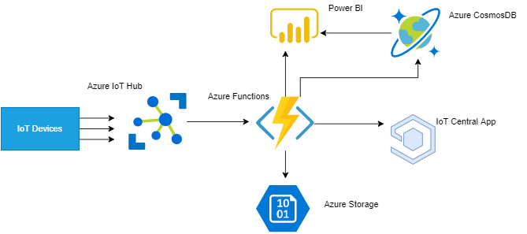

To put the solution together, the following Cloud Services will be used:

- **Azure IoT Hub** - IoT Hub is a managed service, hosted in the cloud, that acts as a central message hub for bi-directional communication between your IoT application and the devices it manages.
- **Azure IoT Central** - Azure IoT Central is a fully managed SaaS (software-as-a-service) solution that makes it easy to connect, monitor and manage your IoT assets at scale.
- **Azure Functions** - Azure Functions is a server less compute service that lets you run event-triggered code without having to explicitly provision or manage infrastructure.
- **Azure Cosmos DB** - Azure Cosmos DB is Microsoft’s globally distributed, multi-model database service for operational and analytics workloads. It offers multi-mastering feature by automatically scaling throughput, compute, and storage.
- **Azure Blob Storage** - Azure Blob storage is Microsoft's object storage solution for the cloud. Blob storage is optimized for storing massive amounts of unstructured data, such as text or binary data.
- **Power BI Service (Optional)** - Power BI is a business analytics solution that lets you visualize your data and share insights across your organization.

## What You'll need

- An Azure account with an active subscription
- A PowerBI Pro License Account
- A text editor
- Deployment code and files which can be found in this repository
- Basic knowledge of any programming language

## Instructions

### Resource Provisioning

- You'll use the Azure CLI to deploy some of the resources in the solution.The Azure command-line interface (CLI) is Microsoft's cross-platform command-line experience for managing Azure resources. Head over to https://docs.microsoft.com/en-us/cli/azure/install-azure-cli?view=azure-cli-latest and download the latest version of the Azure CLI appropriate for your operating system.
- After installing the Azure CLI, run

           $ az login

  This will log you into the appropriate azure account you want to use.

- Start by creating a resource group. A resource group is a container that holds related resources for an Azure solution.You may replace _example_ with the name you want to give to your resource group but remember to change to that name whenever we need to deploy additional resource. Depending on where you are located, you may want to change the  resource group location, but this is not important for now.

       $az group create --name example --location "East US"

  Take a note of the resource group name you used above, you will need it in subsequent steps.

- Now that you have a nice container for your resources, you can begin deploying the required resources. You will deploy the Azure IoT Hub, a Function App (where all your Azure Functions will be hosted), a Storage account, an Azure IoT central application and the Azure Cosmos DB for data storage. The deployment template and a parameter file is provided in this repository in the _deployment_templates_ folder. The ARM template is called **template.json**, you will upload this in Azure Portal to create the resources. Also given in the same folder is a parameters json file, you would use this if you were deploying from the CLI and needed to change the parameters.

- Open the Azure Portal and click **Create Resource**. Search for *template* and select **Template deployment**. Click **Create** then choose *Build your own template in the editor* 

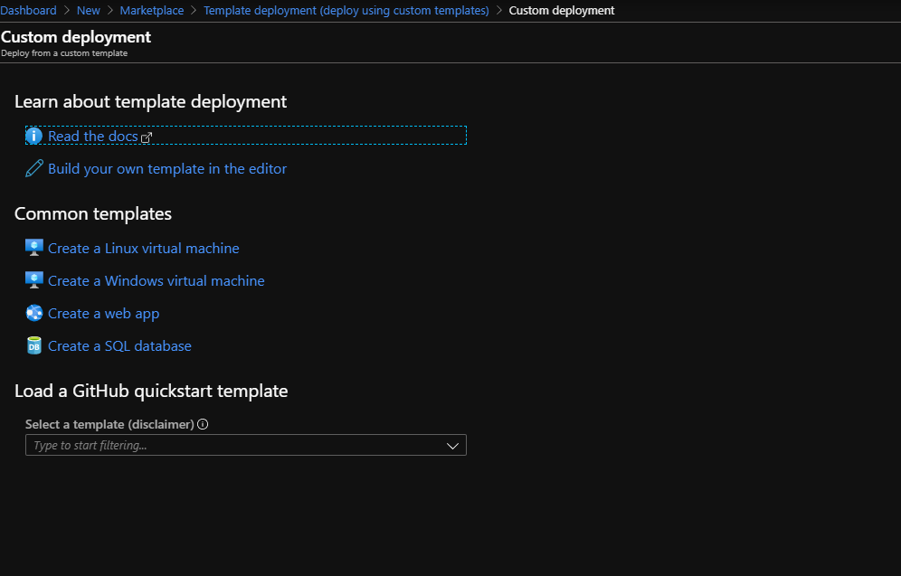
- Choose **Load file** and choose the *template.json* file in the local repository (in the *deployment_templates* folder). This will populate the portal with the template along with the default values of all the parameters. Click **Save**
- Choose a **Subscription** then select the Resource Group you created earlier. Under **Settings**, you will need to change all the names of the resources (these are the parameters passed to the template in order for it to create the resources). All these must be unique, so try to prefix them with the name of your company

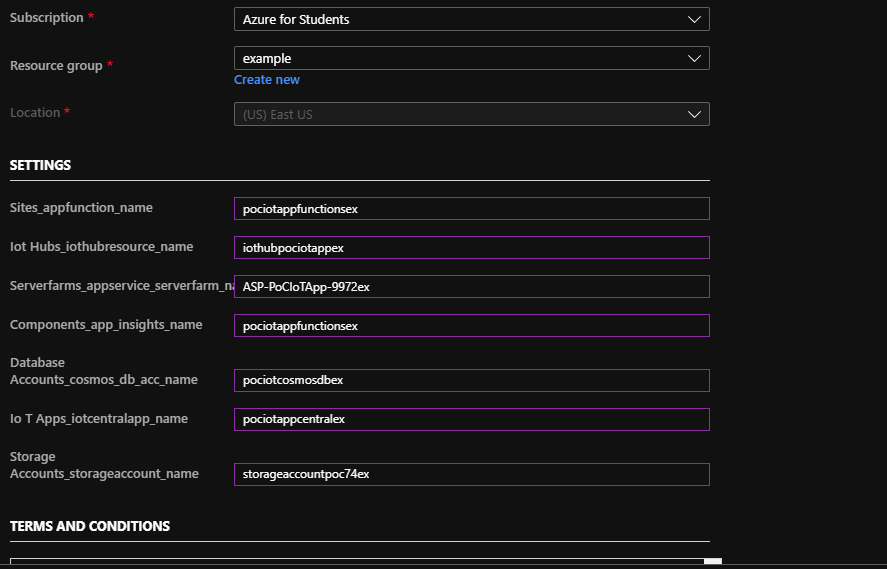

Agree to the terms and conditions then click **Purchase**.

The most likely issue you might encounter when deploying the resources is errors to do with unique or illegal values in your parameters file. If you get any validation error, select **Click here to view details**, read the error, then correct the illegal parameter name and click **Purchase** again. 

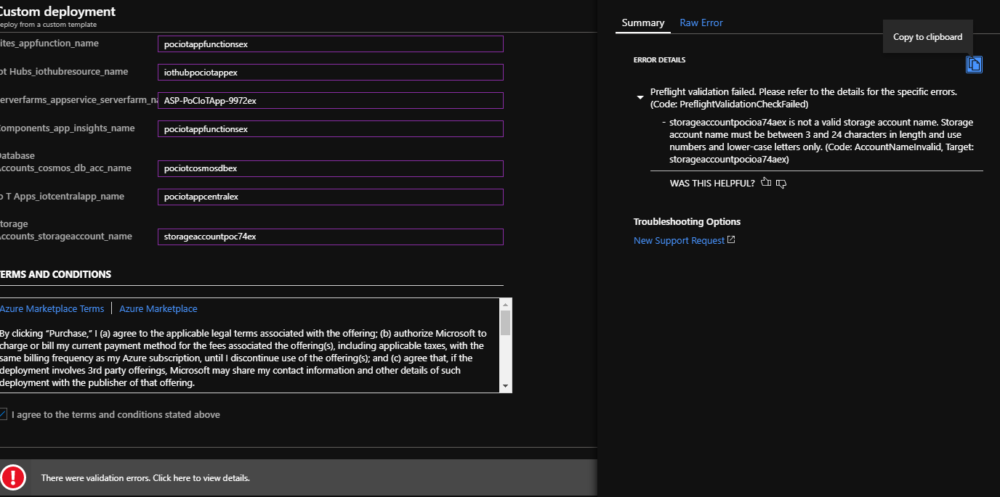
- If you view your resource group on Azure Portal, you should see several resources deployed:

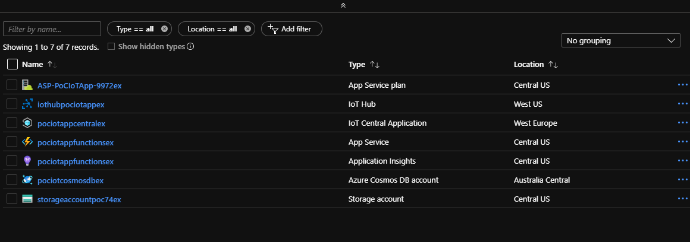


- Add the Azure IoT CLI extension to the Azure CLI by running the following command in your local development computer:

        $az extension add --name azure-cli-iot-ext

You will need this later.


- In the Azure Portal , in the resource group you created Click on the IoT Central App resource (It is of type **IoT Central Application**). There isn't much you can do with the Application from the Portal, but from there you will get the application's url.
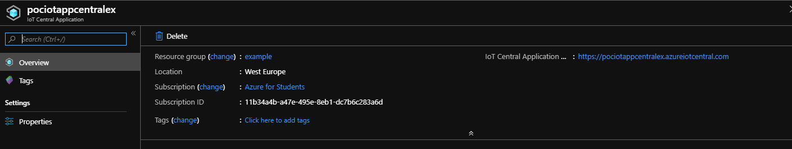
 Follow the URL and you will land on the Dashboard of the IoT Central Application.

- On the Left Side bar, under **App settings** click on **Device Templates**.

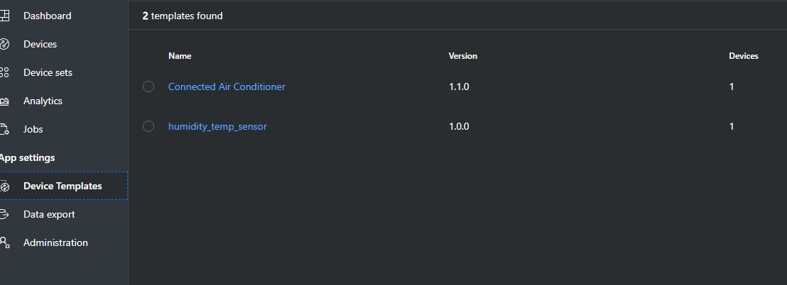

Click the **humidity_temp_sensor** template. You will see the configured measurements that the template expects from the device. The visuals will start to populate with some values, these are simulated values from the app itself, it just gives you an idea of how everything will be working.

- The **Device Template** is only a blue print of what data points the device is sending, you still need to configure an actual device. On the side navigation, click on **Devices**. You should see the the **humidity_temp_sensor** template. Click on it. Notice there is already a device for this template, that was generated automatically and it simulates your device data. Select **+**, then Real. Click **Create**


The device is now created and ready to receive telemetry.

### Device Registration and Simulation

- All the required resources are set up. Referring back to the system architecture, the first block in the flow is the virtual device (or a real one if you have one). Before a device is allowed to talk to the IoT Hub, it needs to be registered with that particular Azure IoT Hub. Run the command below on the terminal to register and create a device in the IoT Hub. You can log back into the portal and confirm the name of your IoT hub, change the `--device-id` parameter to your preferred name.

        $ az iot hub device-identity create --hub-name {YourIoTHubName} --device-id mySimulatedDevice

- The device is registered but you need its connection string which has the endpoint and keys. To get this, run the following command.

        $ az iot hub device-identity show-connection-string --hub-name {YourIoTHubName} --device-id mySimulatedDevice

  Copy the returned `connectionString` value and store it somewhere, you will need it in the preceding steps.

- You will also need to create a consumer group which will be used by Azure Functions to pull data from the IoT Hub. Run the following command replacing the hub name with the name you called you're IoT Hub. You can leave the name of the consumer group to `data` but if you choose to change it, remember to also change it in subsequent steps that require the name of the consumer group.

        $az iot hub consumer-group create --hub-name {YourIoTHubName} --name data

- Next is to configure the function application. You will have two functions - one function will simulate the actual devices (you can use a real device if you have one) and the other function will be the main function in charge of receiving telemetry from the IoT Hub, formatting and transforming it before sending it to the various endpoints for storage and visualization. The function app consisting of both functions is provided as a zip folder in this repository (**functionapp.zip**).
- Head back to the Azure Portal under your resource group and take note of the name of your Function Application (The **Application Service** type)

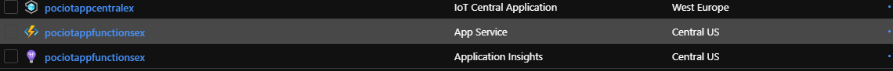

- To deploy your function run the following command replacing the `-g` and `-n` parameters with your resource group name and function app name respectively.

        az functionapp deployment source config-zip  -g {your_resource_group} -n {your_function_app} --src functionapp.zip
   It is assumed that you are running the command at the root of this repository where the **functionapp.zip** file is located.
   **Note**: This will take some time, and if your connection is intermittent or unstable, the deployment will fail.

- Open the Azure Portal, then your resource group and then click on the function app. You should see two functions deployed, `simulated-device` and `intermediateProcessing`.

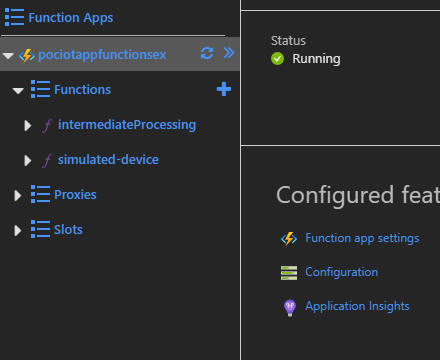

- Click on the **simulated-device** function to open it. This code sends simulated temperature and humidity values(and the device Id) to an IoT Hub endpoint. You need to edit the connection string value of the IoT Hub to send it to your configured hub and device (the IoT Hub connection string you noted down while registering the device).

```JavaScript
// Using the Azure CLI:
// az iot hub device-identity show-connection-string --hub-name {YourIoTHubName} --device-id MyNodeDevice --output table
var connectionString =
  "{input your connection string here}";

```
 Once you change to the correct connection string, save the file by clicking **Save** at the top of the page.


- At the bottom of the **simulated-device** page, click on the **Logs** tab, Click **Clear** to get rid of the previous logs which would have errors since the IoT Hub was not yet configured correctly. Wait for a few moments and you should see some logs indicating the function is running smoothly.

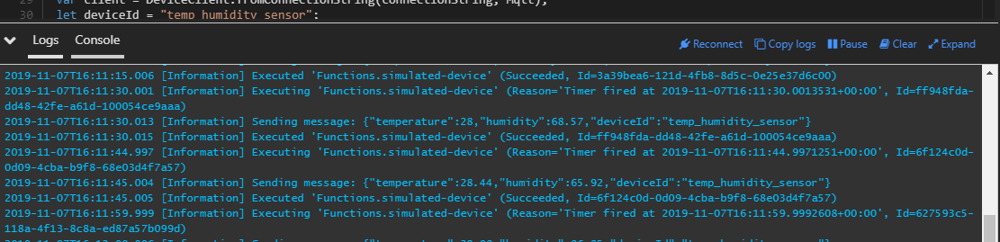


- The Function should be sending telemetry to your IoT Hub every 15 seconds. Go back to your resource group and click on the IoT Hub. Under, the **Overview** Tab, scroll to bottom, there is a Visualization card named **IoT Hub Usage**, on it you will see the number of messages sent today (if it it more than zero, then the device simulator function is working correctly).

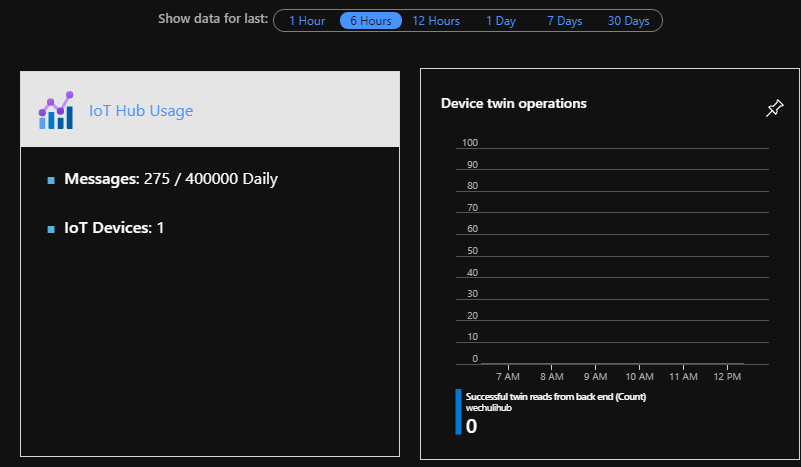

- The messages are successfully arriving at the IoT Hub, you need to take these messages and process them before forwarding them to storage and to the Azure IoT Central application (and optionally the Power BI service). Again, Azure Functions will be used for this task, but this time instead of the trigger being a timer, the trigger will be a message arriving at the IoT Hub end point.

- Head back to your Function App and click on the `intermediateProcessing` function. The code processes data sent from the IoT Hub and stores it in both Azure Storage and Azure CosmosDB before forwarding telemetry to the IoT Central App and Power BI. You need to configure a few settings before this function works.
- Under the `intermediateProcessing` function, click on **Integrate**. Azure functions are event driven, so all functions will have a **Trigger**. Functions may also have Inputs and Outputs. The function has one trigger,Azure Event Hubs messages which is from the IoT Hub. It also has two Outputs - Azure Cosmos DB and Azure Blob Storage. All you need to do is configure the trigger and the outputs to the resources you provisioned.
- Select the **Azure Event Hubs** trigger. Under **Event Hub connection**, select *new* then **IoT Hub**, select the IoT Hub you earlier provisioned (if you have other IoT Hubs you will need to select the appropriate one).
 
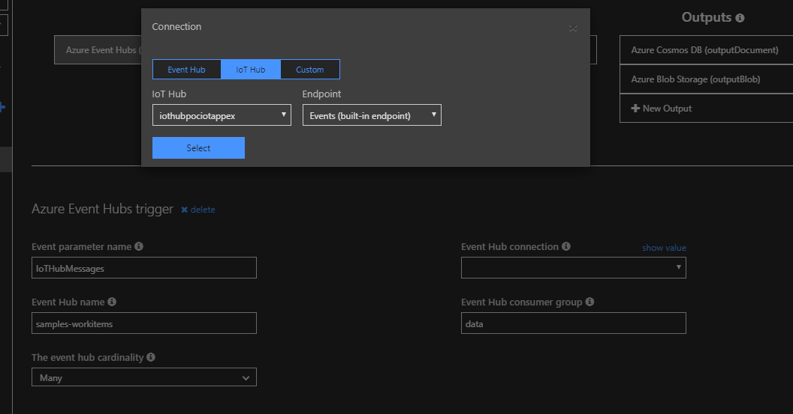

 Click **Select**, leave all the other settings as they are and click **Save**.
- Under **Outputs** , Click on the **Azure Cosmos DB** output. You only need to change one setting here, under **Azure Cosmos DB account connection**, click *new*, select the appropriate Subscription and choose the correct **Database Account** - If you have other database accounts, make sure you select the one you provisioned earlier.

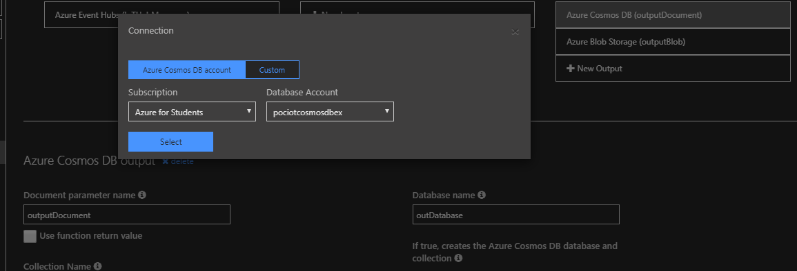

Click on **Select**, leave all the other settings as they are and click **Save**.

- The Azure Blob Storage output is correctly configured so you don't need to edit anything there. Click the `intermediateProcessing` function again and examine the code. There are three variables pertaining to the device you created in the IoT Central Application that need to be changed so that data may be forwarded correctly; `idScope`, `registrationId` and `symmetricKey`. All these are obtained from the Azure Central Application.

- Go back to the web dashboard of the Azure Central Application you created. Click on **Devices** then choose the **humidity_temp_sensor**, select the real device you made, at the top of the device dashboard, click **Connect**.

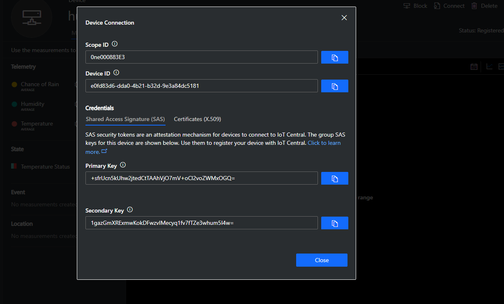

take note of the **Scope ID**, **Device ID**, and **Primary Key**.

- Back in the Azure Portal and on the `intermediateProcessing` function, replace the values with the one copied on the step above.

```JavaScript
const idScope = "{Scope ID}";
const registrationId = "{Device ID}";
const symmetricKey = "{Primary Key}";

```

   Remember to save the file.

- Click on the function's logs (You might want to clear them first). After some time, the `intermediateProcessing` function should start logging some output to the console.

- Confirm that data is being stored in the Azure CosmosDB database. Go to your Resource Group, click on the Azure CosmosDB Account. On the overview pane, near the top there is a **Data Explorer** link that enables you to view your data. You should see a database named `outDatabase`, and a collection called `MyCollection`. Click on `MyCollection` then click on `Items`. You should see a collection of documents that represent the telemetry your device is producing (actually, this data is coming from the Azure function that processes the telemetry). Click on any one of them, you will see a document containing a number of parameters (some are generated automatically, but some were calculated from the `intermediateProcessing` function).

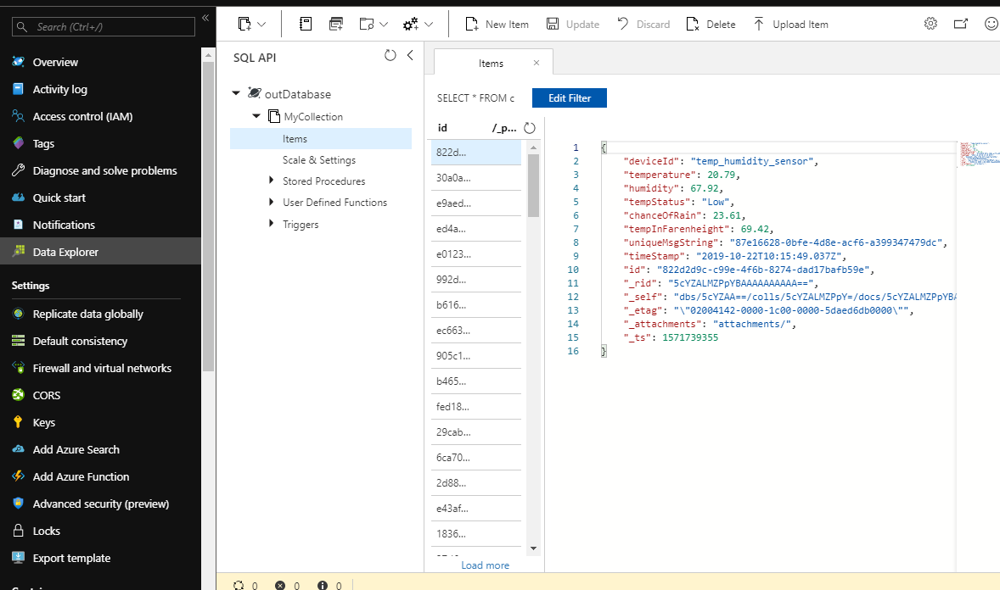

- Azure Cosmos DB is an expensive data store and is best used for warm storage to access recent telemetry while historical data will be stored permanently on Azure storage. We can set the Time To Live (TTL) value on Azure Cosmos DB to delete data after a certain period of time.

- Still on the `MyCollection` collection on the `outDatabase`, click **Scale & Settings**. Under **Settings** > **Time to Live** select **On**. Input 2678400 seconds. This is equal to 31 days, then click **Save** at the top. With this setting, documents will be kept on Warm storage for 31 days before being automatically deleted. This helps to keep cost down as your data grows.
- Data is permanently stored in Azure Blob Storage as blobs. Go back to the Resource Group and select the Storage Account resource. Select **Containers** on the **Overview** page.There is a container called `outcontainer`. If you open it, you will see the blobs which represent the JSON data that has been saved from the Azure function (`intermediateProcessing`)

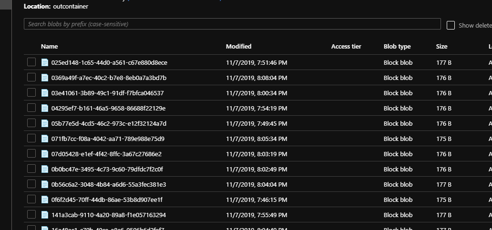
- Click on any of the blobs and download it. If you use a text editor to open the downloaded blob, you will see the JSON formatted data from the telemetry processed by the `intermediateProcessing` function. Data stored in Azure Blob Storage can be persisted for long term storage at a much cheaper cost than data stored in Azure Cosmos DB.

- Switch over to your IoT Central Application and locate the real device you registered. On the Device page, you should see data trickling in.

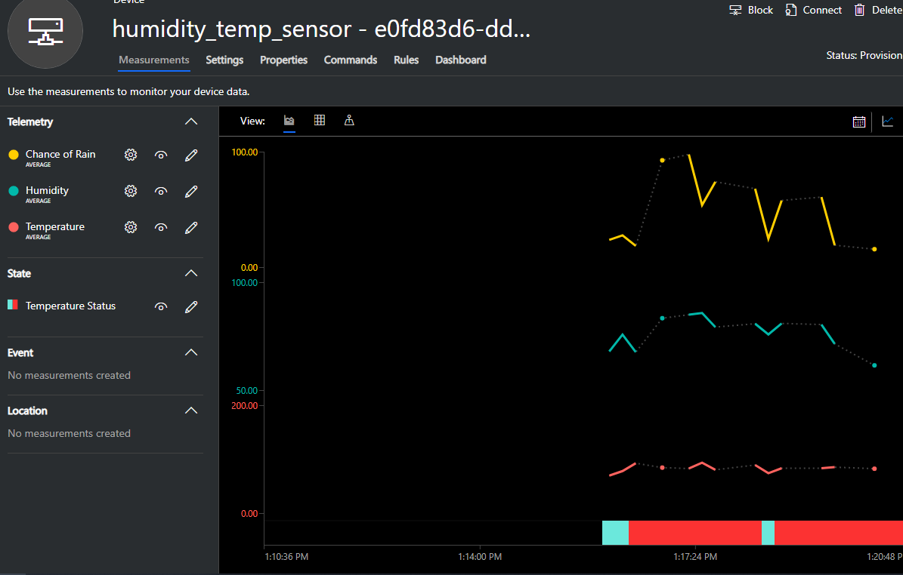

Click on the Dashboard page of that device (still on the Azure IoT Central app), you should see a consolidated visual graphing of the data.

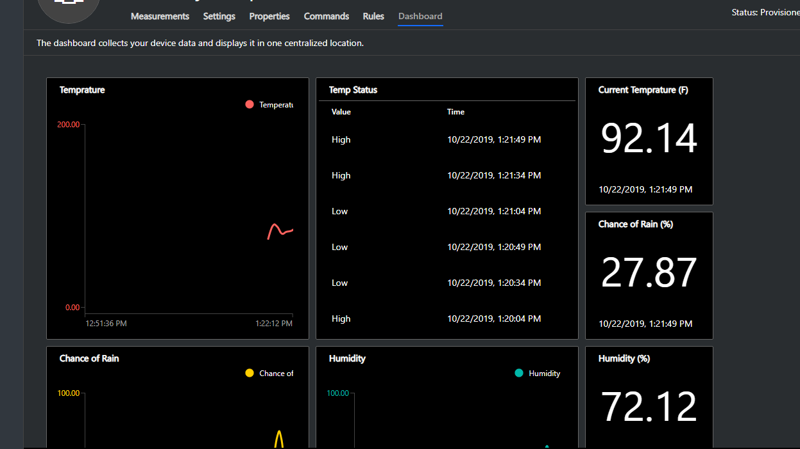

### Power BI Visualization (Optional)

Power BI provides a convenient way to visualize your data and share insights across your organization. Follow the following steps to attach Power BI visuals to your IoT Data.

- The first thing you need to do is to sign up for a Pro PowerBI account (you can get a free 60 days trial). Follow this link https://signup.microsoft.com/signup?sku=a403ebcc-fae0-4ca2-8c8c-7a907fd6c235 to do that. Please note Power BI only accepts business addresses, so Gmail, yahoo, outlook etc. won't work.
- Once you've logged in to Power BI click on **Workspaces**, then **Create a workspace**. You might get a popup asking you to sign up for a free trial, accept it.
- Give the workspace a name and an optional description.Click **Save**. A workspace is basically a container for your dashboards, reports, workbooks and datasets. The first page you should see is the one below.

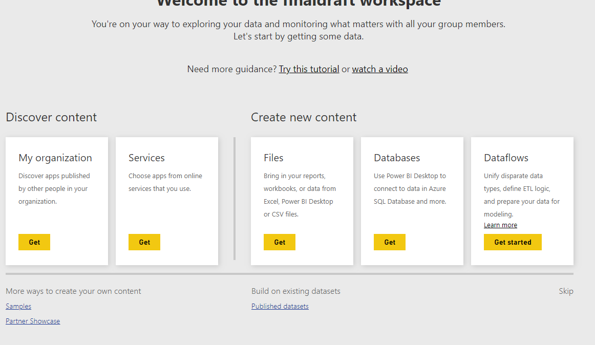

At the bottom right corner, there is a **Skip** link, click on that.

- On the Workspace page click on **Create** at the top, then choose **Streaming dataset**.

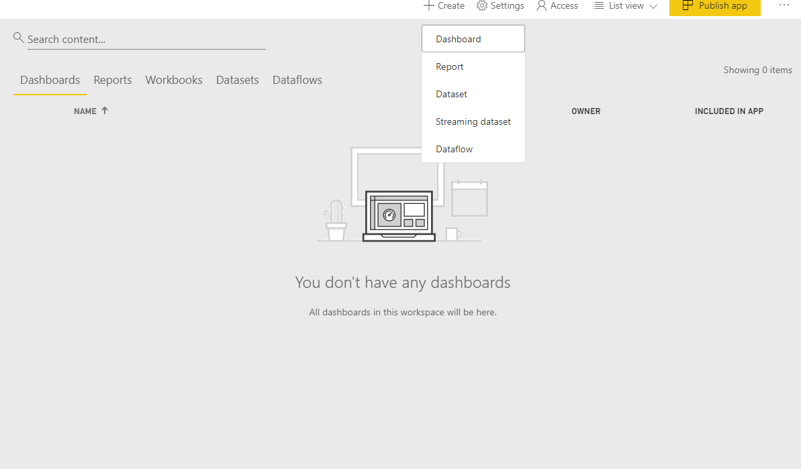

- Select **API**, choose _Next_. Give an name to the Dataset and input each value sent from the `intermediateProcessing` function as shown below, make sure you're spelling matches the one show below (this is how the function shapes the data)

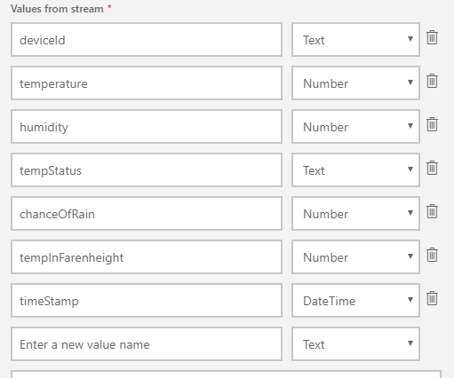

- Make sure you put **Historic data analysis** on otherwise you can't build reports with the data. Your data should have the shape as shown below:

```json
[
  {
    "deviceId": "AAAAA555555",
    "temperature": 98.6,
    "humidity": 98.6,
    "tempStatus": "AAAAA555555",
    "chanceOfRain": 98.6,
    "tempInFahrenheit": 98.6,
    "timeStamp": "2019-10-24T16:57:21.775Z"
  }
]
```

- Click **Create** and copy the Push URL , click **Done**.
- Head back to the `intermediateProcessing` function on the Azure Portal and open the `index.js` file right in the portal. Locate the part of the code that sends data to Power BI

```JavaScript
axios
    .post("{your power bi push url}", output)
```

Replace `{your power bi push url}` with the Push URL you copied. Save the function. After a little while, it should start running again and data should be streaming to your Power BI service account.

- Back on Power BI, at the top of your screen, select **Create**, then choose dashboard and give the dashboard a name.

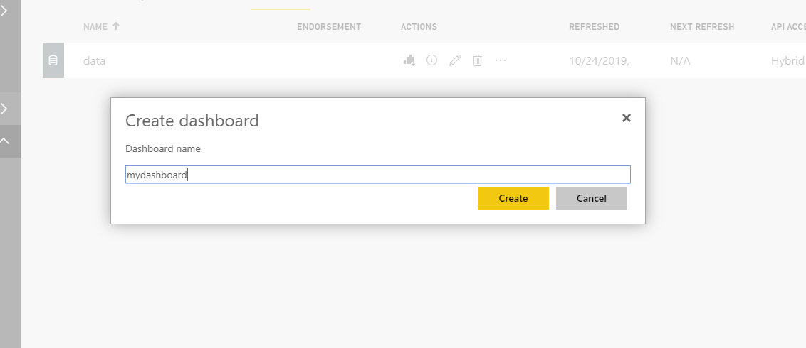

- You will be directed to the dashboard, choose **Add tile** at the top them select **Custom Streaming Data** then click on **Next**. Under Your DataSets, select the live streaming dataset you set up then click **Next**. Under `Visualization Type`, choose `Line chart`, choose the Axis to be **timeStamp**, choose the Legend to be **deviceId** and the Values to be **chance of Rain**. Finally, put the Time Window to display to 10 minutes (you might want to change this to suite your needs.). Click **Next**. Give the visualization a meaningful name then click **Apply**.

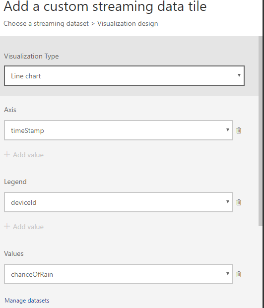
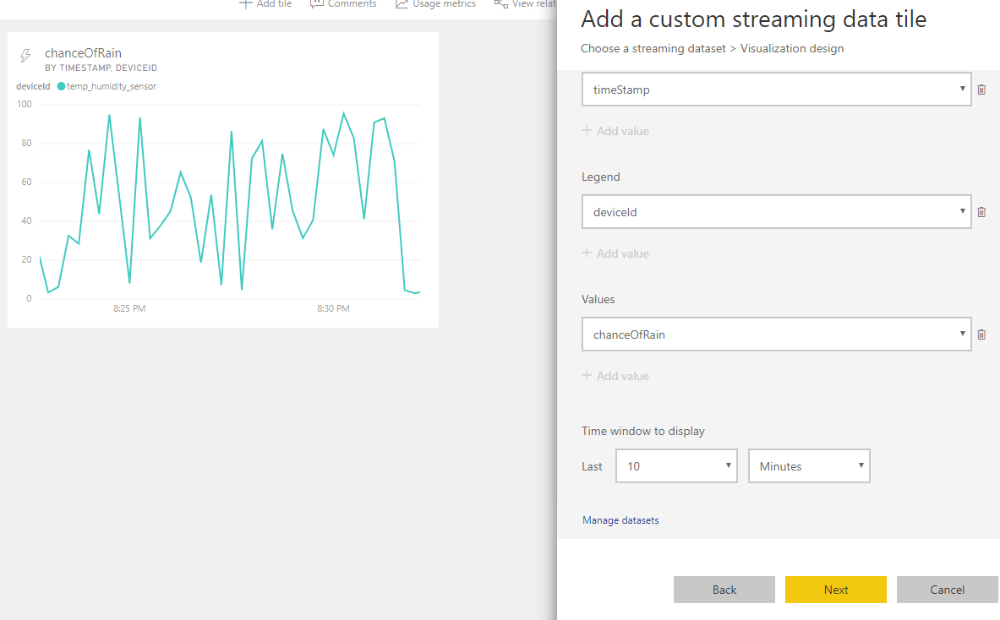

- Your dashboard should now have one tile showing real time readings of the chanceOfRain parameter.

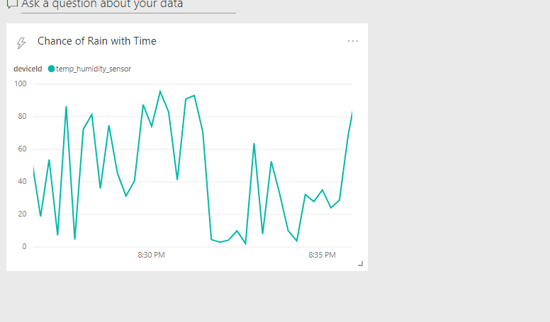

- You can create more visualizations for your streaming data. And you could additionally create reports by clicking on the dataset itself. Reports provide historical analysis for your data, since most useful insights cannot be deduced from plotting only a small timeframe of the streaming data.

- Additional reports may be created from data stored in the Azure Cosmos DB account and Azure Blob Storage.

## Comparison of PowerBI and Azure IoT Central For Visualization

You have used both Power BI and Azure IoT Central to visualize your data but there are some key and important difference between the two techniques. In fact, you could use both of them since they are meant for different use cases.

### Power BI

This is a business intelligence too (hence then name PowerBI) .Power Bi would be suitable as a visualization and analytics tool when data being consumed is needed within the organization.

#### Pros

- You can easily drag and drop components to create visualizations that you want
- You can build custom reports and extract insights from the reports and dashboard.
- Large array of visualization options and widgets.

#### Cons

- Not suitable if you intend to share visualizations with parties outside your organization.
- Every user that the report or dashboard is shared with must have a Power BI Pro account, otherwise they can't access the content. A Pro License is \$9.99/month per user

### Azure IoT Central

Azure Central is a SaaS IoT solution, so it includes more than just device data visualization. The system you built only used it for visualization but it can be used for much more.It is suitable for situations where you want a quick IoT solution without having to worry about setting up infrastructure and writing custom applications.This service is for straightforward solutions that don't require deep service customization.

#### Pros

- Easy to set up
- prebuilt visualization that automatically refresh and update with a template you define
- Ability to simulate a device
- Easy to share access to the application to anyone with a Microsoft Email Account (Outlook.com)
- Can build alerts for devices to be notified when something goes wrong.

#### Cons

- There is no way for you to preprocess the device data before it reaches the IoT Central App since you don' t have access to the underlying infrastructure
- You cannot create custom visualizations and reports
- Data is automatically cleared after 30 days so you have to build integration to store this data yourself.
- Free for the first 5 devices but \$2/month per device thereafter.

## Clean Up The Resources

To delete all of the resources at once run the following command, be sure to change the `--name` parameter to whatever you called your resource group.

        az group delete --name example
