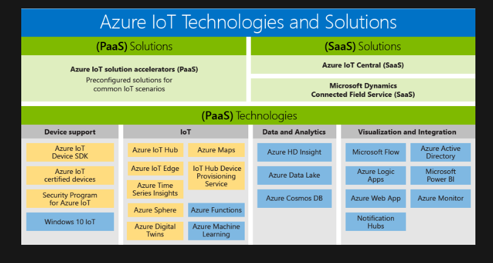
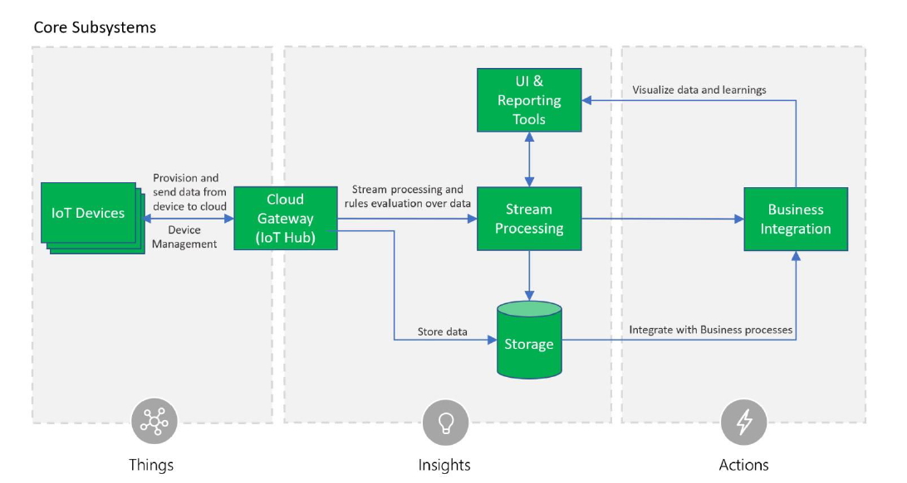
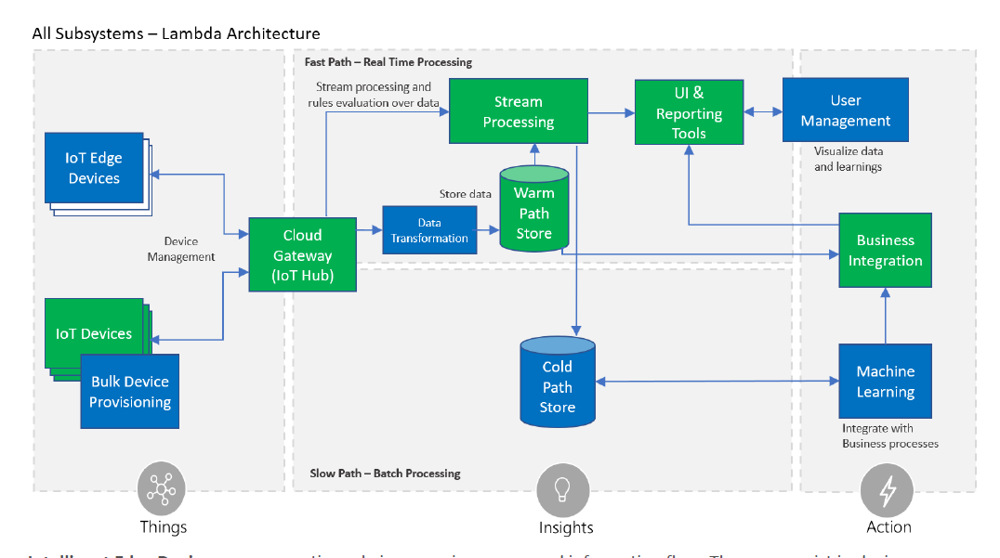
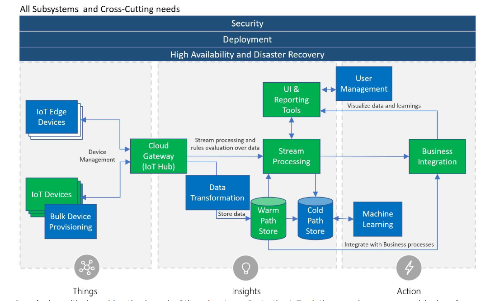
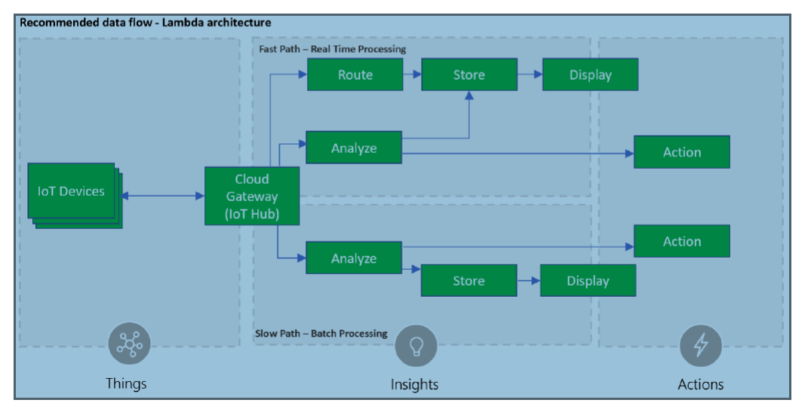
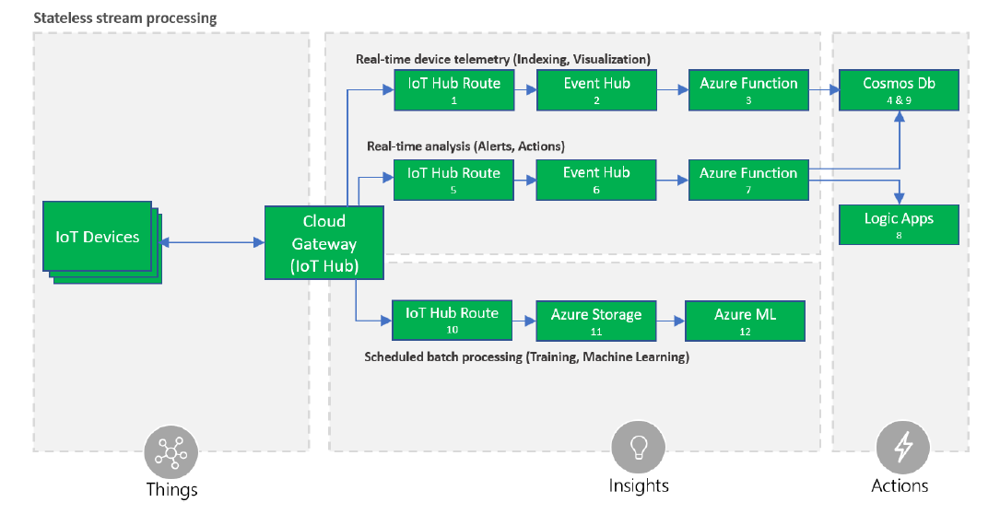

## Microsoft IoT Portfolio

end goal: taking action on business insights we find through gathering data from assets.

## Architecture Overview

The recommended architecture for IoT solutions is cloud native, microservice and serveless based.

### Core Subsystems

At the core an IoT application consists of the following subsystems

- **devices** that have the ability to securely register with the cloud, and connectivity options for sending and receiving data with the cloud.
- **a cloud gateway service or hub** to securely accept that data and provide device management capabilities.
- **stream processors** that consume that data, integrate with business processes and place the data into storage
- **user interface** to visualize telemetry data and facilitate device management.

- The Cloud Gateway provides a cloud hub for secure connectivity, telemetry and event ingestion and device management (including command and control) capabilities. **Azure IoT Hub service** is recommended as the cloud gateway. The IoT Hub offers built-in secure connectivity, telemetry and event ingestion and bi-directional communication with devices including device management with command and control capabilities.
- For registering and connecting large sets of Devices, Azure IoT Device Provisioning Service(DPS) is recommended. DPS allows assignment and registration of devices to specific Azure IoT Hub endpoints at scale.
- Azure IoT Hub SDKs are recommedned to enable secure device to connectivity and sending telemetry data to the cloud
- Stream processing processes large streams of data records and evaluates rules for those streams. For stream processing we recommend using Azure Stream Analytics for IoT applications that require complex rule processing at scale. For simple rules processing we recommend Azure IoT Hub Routes used with Azure Functions.
- Business process integration facilitates executing actions based on insights garnered from device telemetry data during stream processing. Integration could include storage of informational messages, alarms, sending email or SMS, integration with CRM and more. Azure Functions and Logic Apps for business process integration are recommended.
- Storage can be divided into warm path ( data that is required to be available for reporting and visualization immediately from devices), and cold path (data that is tored longer term and used for batch processing). Azure Cosmos DB is recommended for warm path storage and Azure Blob Storage for cold storage. For application with time series specific reporting, Azure Time Series Insights is recommended.
- The user interface for an IoT applciation can be delivered on a wide array of device types, in native applications and browsers. The needs across IoT Systems for UI and reporting are diverse and Power BI, TSI Explorer, native applications and custom web UI applications.

In addition to the core subsystems many IoT applications will include subsystems for

- intelligent edge devices which allow aggregation or transformation of telemtry data and on premise processing.
- cloud telemetry data transformation which allows restructuring, combination or transformation of telemtry data sent from devices
- machine learning which allows predictive algorithms to be executed over historical telemetry data, enabling scenarions such as predictive maintenance
- user management which allows splitting of funtionality amongst different roles and users

There are multiple cross-cutting needs for IoT applications that are critical for success including

- **security** requirements; including user management and auditing, device connectivity, in-transit telemetry and at rest security
- **logging and monitoring** for an IoT cloud application is critical for determinging health and for troubleshooting failures both for individual subsystems and applicationas a whole
- **high availability and disaster recovery** which is used to rapidly recover from systematic failures

**Security** is a critical consideration in each of the subsystems. Protecting IoT solutions requires secure provisionign of devices, secure connectivity between devices, edge devices and the cloud , secure across to the backend solutions, amd secure data protection in the coud during processing and storage.For storage technologies we recommend using Azure Cosmos DB for warm path storage and Azure Blob Storage for cold storage both of which support encryption at rest. For user management, such as authenticating user credentials, authorization of user UI capabilities, reporting and management tools users have access to, and auditing application activities we recommend Azure Active Directory. Azure Active Directory supports the widely used OAuth2 authorization protocol, OpenID Connect authentication layer, and provides

**Logging and monitoring** for IoT application is critical in determinign system uptime and troubleshooting failures.

### Device and data models

Information models describing the devices, their attributes and associated data schema are key for implementing solution business logic and processing.
The architecture adopts a fundamental abstraction of data streams, where device and data models are not required to flow, route or store information in the core platform components.
At the solution layer, structured data will be guarded by data models and schema whenever it is produced or consumed by the components. Developers have the option of using schemas for device-client development, backend analytics or specific procesing logic as required by the solution.

### Data records and streams

IoT solutions are designed considering the fundamental aspect of devices periodically transmitting data records, which are represented, analyzed and stored as multiple and continous data streams. Messages, events, telemetry, alerts and ingestiong are terms commonly used when descrining IoT data streams.
Data records are usually timestamped, sorted by time and associated to at least one source.

- **Ingestion** is the process of uploading data records into storage, through a gateway such as Azure IoT edge and Azure IoT Hub
- **Messages and events** are interchangeable terms used when referring to the data records generated by connected devices. The term telemetry is used specifically for messages for messages carrying data reported by device sensors.
  Telemetry records are usually analyzed, locally or in the cloud, against a set of rules. A different type of data record can ge generated as a result, commonly referred as an alert.
  JSON data format is recommended for IoT Solutions

In order to simplify deserialization, non-breaking changes and segragation of streams by version should be allowed. A best practice is for IoT solutions to include metadata in each record e.g using message properties, specifying format and version. With a versioning model in place, solution developers can appropriately resolve potential conflicts or record fields in terms of semantics or type e.g if a specific device firmware changes and thereafter the device sends data records in adifferent format, versioning will allows the solution developer to disambiguate between data streams.

### Device interaction

The refernce model adopts the principles of the Service Assisted Communication approach for establishing trustworthy bidirectional communication with devices that are potentially deployed in untrusted physical space. The following principles apply

- Devices do not accept unsolicited network connections. All connections and routes are established in an outbound-only fashion
- Devices generally only connect to or establish routes to well-known service gateways that they are peered with.
- The communication path between device and service or device and gateway is secured at the transport and application protocol layers, mutually authentication the device to the service or gateway and vice versa.
- System-level authorization and authentication should be basued in per device identities, and access credentials and permissions should be near-instantly revocable in case of device abuse.
- Bidirectional communication for devices that are connected sporadically due to power or connectivity concerns may be facilitated through holding commands and notifications to the device until they connect to pick those up.
- Application payload data may be separately secured for protected transit through gateways to a particular service.

#### Cloud gateway

A cloud gateway enables remote communication to and from devies or edge devices, which potentially reside at several different sites. It generally manages all aspects of communication, including transport-protocol-level connection management, protection of the communication path, device authentication, and authorization toward the system. It enforces connection and throughput quotas and collects data used for billing, diagnostics and other monitoring tasks. The data flow from the device through the cloud gateway is executed through one or more multiple application-level messaging protocols.

##### Technology options

- **Azure IoT Hub** - Azure IoT Hub is a high-scale service enabling secure bidirectional communication from a variety of devices. Azure IoT Hub connects millions of devices and supports high-volume telemetry ingestion to a cloud backend as well as command and control traffic to devices.Azure IoT Hub supports multiple consumers for cloud ingestion as well as the inbox pattern for devices. Azure IoT Hub provides support for the AMQP 1.0 with optional WebSocket10 support, MQTT 3.1.111, and native HTTP 1.1 over TLS protocols.
- **Azure Event Hubs** - Azure Event Hub is a high-scale ingestion-only service for collecting telemetry data from concurrent sources at a very high throughput rates. Event Hub doesn't offere per-device identity or command and control capabilities, so it might be suited only for additional data streams that could be correlated with device telemetry on the backend but not as a primary gateway for connecting devices.

#### Client components

Client components provide a set of capabilities that can be integrated in the software code running on the device to simplify the connectivity to a backend. They are typically provided as libraries or SDKs that can be linked or compiled into the software layer of the device.

##### Technology options

- **Azure IoT device SDKs** - The Azure IoT device SDKs represent a set of client components that can be used on devices or gateways to simplify the connectivity to AZure IoT Hub. The device SDKs can be used to implement an IoT Client that facilitates the connectivity to the cloud. They provide a consistent client development experience across platforms and help abstract the complexity of distributed systems messaging from device developers. These libraries enable the connectivity of a heterogeneous range of devices and field gateways to an Azure based IoT solution. They simplify common connectivity tasks by abstracting details of the underlying protocols and message processing patterns. The libraries can be used directly in a device application or to create a separate agent running on the device that establishes connectivity with the cloud gateway and facilitates the communication between the device and the IoT solution backend.

The Azure IoT device SDKs are an open-source framework that is aligned with the Azure IoT platform capabilities. While these libraries simplify the connectivity to Azure IoT Hub, they are optional and not required if device developers choose to connect to the IoT Hub endpoints using existing frameworks and supported protocol standards.

### Device identity store

Device identity authority. The device identity store is the authority for all device identity information. It also stores and allows for validation of cryptographic secrets for the purposes of device client authentication. The identity store typically does not provide any indexing or search facility beyond direct lookup by the device identifier.

The cloud gateway relies on the information in the identity store for the purposes of device authentication and management. The identity store could be contained in the cloud gateway, or alternatively, the cloud gateways could use separate device identities externally.

**Provisioning** Device provisioning uses the identity store to create identities for new devices in the scope of the system or to remove devices from the system. Devices can also be anabled or disabled.

**Technology options**
Azure IoT Hub which includes a built-in device identity store that is the authority for registered device and provides per-device security credentials.

### Topology and entity store

**Device and application model**. Device and application models are foundational for building application business logic. Examples include the ability to define and condifure business rules, perform search for subset of devices or application entities, build User Interface and dashboards, and to ensure consistency across different coponents of the solution and other backend systems.

Device models ften describe:

- The schema for metadata about the device including characteristics and/or capabilites if a device.
- Data shemas for data emitted by the device, which define the telmetry attributes along with their data types and allowed ranges.
- Schemas for configuration parameters controlling device behaviors.
- Operations and parameters for the control actions a device can perform.
- Device topologies representing a domain model, such as rich relationships between devices and other entities, and semantic connections for business operating context.

The complexity of the applicaion model highly depends on the domain specific requirements. In some cases, a hierarchial topology model will be used, while in other cases a graph topology might be more appropriate.

Devices are represented as nodes in the overall application topology. In many solutions, the entities of interest from a business perspective are not the same as the devices itself. The primary asset of a company can be a machine or product that has more or more device embedded.

**Definition and function**. The topology and entity store is a database that contains application entities and relationships among the entities. It also contains device metadata and attributes for provisioned devices (represented by device entity in the overall topology).

The topology and entity store contain a 'run-time' representation of the application model.

**Device identity registry versus topology and entity store.** While the device identity store only contains system controlled attributes and cryptographic material, the topology and entity store have a full representation of a device, including its relation to other entities, such as products, assets, or machines. The record in the identity store determined whether a device is registered and can authenticate with the system. For security reasons, it's good practice to keep the security related info separate from the device entity. The entity store must not store any key or other cryptographic information related to the device.

The device identity store represents the authoritative list of device identities (primariy for authentication purposes). The topology and entity store in contrast, has the full set of device metadata (device attributes, properties, opertaions etx) among relations to other application entities, required for the application to perform its business functions. This store is the one used for device discovery, as well as discovery of other application entities and provides reach indexing and powerful search capabilities.

The topology and entity store is the authoritative store for entities and their relationships for the IoT solution, ensuring consistent view across the system.

Metadata. The distinction between metadata describing the device itself and operational data reflecting the state of the device or its operating environment is important because it directly impacts how the device information can be used, cached, and distributed throughout the system. Metadata is typically slow-changing data, while the operational data is expected to be fast-changing.

**Technology options**
The topology and entity store providing descriptive information about entities and devices should provide rich or freeform index capabilities with the goal of providing fast lookups:

- Azure Cosmos DB
- Azure SQL Database
- Third-party options

#### Device Provisioning

Provisioning represents the step of the device life cycle when a device is to be made known to the system. The provisioning API is the common external interface for how changes are made to the internal components of the backend, specifically the device identity store and the topology and entity store. It provides an abstract interface with common gestures, and there is an implementation of that abstract interface for the device identity and topology and entity stores. The implementation can be extended to include other components and systems.

Device provisioning is typically initiated at the backend, by registering devices in the system before they become operational. In some cases, this may happen during manufacturing of the devices (including burning in device identity and credentials required to connect to the IoT backend). In other cases, the provisioning may be performed immediately before the device is turned on for usage, for example during device installation. The first time a device is trying to establish a connection to the backend, additional steps might be performed to finalize its configuration.

**Provisioning workflow**
A solution's provisioning workflow takes care of processing individual and bulk requests for registering new devices and updating or removing existing devices. It will also handle the activation, and potentially the temporary access suspension and eventual access resumption. The provisioning workflow ensures , that the device is registered with all backend systems that need to know about its identity and additional metadata attributes as needed.

**Technology options**

The Azure IoT Hub Device Provisioning Service (DPS) is recommended for device provisioning. DPS is a global provisioning service that supports registration and configuration of devices across multiple IoT Hubs. DPS simplifies the automation of device provisioning. DPS simplifies the automation of device provisioning into the device identity store (part of IoT Hub), while providing flexibility to control the distribution of devices.

DPS offers an API for backend systems for the device registration, as well as API for the device configuration (bootstrapping). DPS can be used in the provisioning workflow to automate the distribution of devices across IoT Hubs, alongside with other steps for registering devices in other backend components and systems (such as the topology and entity store, or a 3rd party provider system)

### Storage

IoT solutions can generate significant amounts of data depending on how many devices are in the solution, how often they send data and the size of payload in the data records sent from devices. Data is often time series data and is required to be stored where it can be used in visualization and reporting as well as later accessed for additional processing.
It is common to have data split into "warm" and "cold" data stores. The warm data store holds recent data that needs to be accessed with low latency. Data stored in cold storage is typically historical data.

Azure Cosmos DB is recommended for warm storage and Azure Blob Storage for cold storage

**Warm Storage**

- Azure Cosmos DB
- Azure SQL DB- best for datasets that require relational storage and query capabilities.
- Azure Time Series Insights (TSI). Azure TSI is an analytics, storage and visualization service for time series data, providing capabilities including SQL-like filtering and aggregation, alleviating the need for user-defined functions.

**Cold Storage**
Instead of keeping all data in a warm data storage with low latency, high throughput and full query capabilities, data can be split into warm and cold storage paths. This can provide lower storage costs while still preserving historical data. A cold storage database holds data that is not needed as quickly and/or frequently as warm storage, but still may be necessary to access in the future for reporting, analysis, machine learning use, etc.

**Technology Options**

- Azure Blob Storage is a simple inexpensive file storage database. Blobs can be used to store raw device data.
- Azure Data Lake is a distributed data store that can persist large amounts of relational and nonrelational data without transformation or schema definition. It is a good choice for a storage database if big data analytics and/or unlimited storage are required.

### Data flow and stream processing

As data is ingested to the IoT backend, it is important to understand how the flow of data processing may vary. Depending on scenarios and applications, data records can flow through different stages, combined in different order, and often processed by concurrent parallel tasks.

These stages can be classified in four categories: storage, routing, analysis and action/display:

- **storage** includes in-memory caches, temporary queues and permanent archives
- **Routing** allows dispatching of data records to one or more storage endpoints, analysis processes and actions
- **Analysis** is used to run input data records through a set of conditions and can produce different output data records
- Original input data records and analysis output records are typically stored and available to display, and may trigger actions such as emails, instant messages, incident tickets, CRM tasks, device commands, etc.

**Recommended data flow**
The reference architecture assumes that a business runs multiple concurrent stream processors, either by partitioning the ingested stream, or by forwarding data records to multiple pipelines.

It is recommended that data records flow through two distinct paths

1.  A fast process that archives and displays incoming messages and also analyzes these records generating short-term critical information and actions, such as alarms
2.  A slow processing pipeline executing complex analysis, for example combining from multiple sources and over long period of time and generating new information such as reports , machine learning models etc.

**Stateless stream processing**

**Stateful stream processing**

The following architecture describes a fast, flexible and scalable solution for stateful real-time analysis of ingested data records in multiple formats,with the ability to reference external data, without the limitations of the previous architecture, at the expense of a greater operational cost.

The architecture is similar to the solution recommended for stateless processing only the analysis path is replaced with Azure Stream Analytics (ASA)

ASA is designed for hyper-scale analysis and routing of data records, in a stateful fashion, with the ability to apply complex queries over time periods and multiple streams. Queries are defined using a SQL-like language that allows transformations and computations. The service tolerates late (up to 21 days) and out-of-order (up to one hour) events, when processing by application time35, in which case the output is therefore delayed by the time difference.

ASA also guarantees exactly once delivery to the supported destinations, with few documented36 exceptions that may generate duplicates. The query language allows optimized performance analysis via parallelization, and by breaking queries into steps.

ASA also supports data records in Avro format, a compact binary format used to reduce latency and bandwidth cost.
In addition to ASA performing stream processing, in this architecture one Azure IoT Hub route is used to forward all telemetry (#1) to an Azure function (#3) that can transform it into a different format, e.g. joining external information, and store it to Cosmos DB (#4) for consumption, e.g. display on a dashboard.

A separate Azure IoT Hub route (#10) is used to copy all incoming data records into Azure Storage Blobs (#11), where it can be archived indefinitely at low cost, and is easily accessible for batch processing, such as Azure Machine Learning data science tasks (#12).
**Benefits of the architecture**

- High availability due to geographic redundancy and quick disaster recovery features of Azure services.
- Minimal operational costs, because all the components are managed Azure services.
- Azure Stream Analytics ability to execute complex analysis at scale, for instance use of tumbling/sliding/hopping windows, stream aggregations, and external data source joins.
- Flexibility: Azure Functions and Cosmos DB allow transformation of ingested data to any desired schema, supporting multiple access patterns and APIs like MongoDB, Cassandra and Graph APIs.
- Actions and Business Integration: A wide choice of integrations are available via Logic Apps and Azure ML.
- Performance: Support for binary data streams, in order to reduce latency.

**When to implement this architecture**

1. Input data records require complex analysis, such as time windows, streams aggregation, or joins with external data sources, which is not possible with the stateless architecture.
2. The processing logic consists of several rules or logic units, which might grow in time.
3. Input telemetry is serialized in a binary format like Avro.

### Solution User Interface

The solution user interface (UI) typically includes a website and reporting, but can also include web service and a mobile or desktop app.
The solution UI can provide access to and visualization of device data and analysis results, discovery of devices through the registry, command and control capabilities and provisioning workflows. In many cases, end users will be notified of alerts, alarm conditions or necessary actions that need to be taken through push notifications.
The solution UI can also provide or integrate with live and interactive dashboard, which are a suitable form of visualizations for IoT scenarios with a large population of device.
IoT solutions often include geo-location and geo-aware services and the UI will need to provide appropriate controls and capabilities.
As stated in beginning of this document, security is critical and the solution UI that provides control over the system and devices needs to be secured appropriately with access control differentiated by user roles and depending on authorization.

**Technology options**

- Azure App Service
- Azure Time Series Insights (TSI)
- Azure Notification Hubs enables sending push notifications to personal mobile devices (smartphones and tablets). It supports iOS, Android, Windows and Kindle Platforms

In addition to the traditional UI, dashboards are very important in IoT scenarios because they provide a natural way for aggregated views and help visualize a vast number of devices. Power BI is a cloud-based service that provides an easy way to create rich, interactive dashboards for visualizations and analysis.Power BI also offers live dashboards, which allow users to monitor changes in the data and indicators. Power BI includes native apps for desktop and mobile devices.

Another suitable technology for IoT visualization is Azure Maps. The Azure Maps APIs includes map controls and services that can be used to incorporate Azure Maps in applications and websites. In addition to interactive and static maps, the APIs provide access to geospatial features such as geocoding, route and traffic data, and spatial data sources that can be used to store and query data that has a spatial component, such as device locations.

Web and mobile apps can be integrated with Azure Active Directory (AAD) for authentication and authorization control.The apps will rely on the management of user identities in AAD and can provide role-based access control for application functionality. In many cases there will be logical associations between IoT devices and users (or between groups of devices and groups of users). For example, a device can be owned by someone, used by someone else, and installed or repaired by another user. Similar examples can be true for groups of devices and users. Permissions and role-based access control can be managed as part of an association matrix between device identities (maintained in the device identity store) and user identities managed by AAD. The specific design of this matrix, granularity of permissions, and level of control will depend on the specific solution requirements. This matrix can be implemented on top of the device registry or can use a separate store using different technology

### Monitoring and Logging
IoT solution logging and monitoring systems are used to determine whether the solution is functioning as expected and to help troubleshoot what is wrong with the solution. Monitoring and logging systems aid us answering the following operational questions
- Are devices or systems in an error condition?
- Are devices or systems correctly configured ?
- Are devices or systems generating accurate data ?
- Are systems meeting the expectations of both the business and end customers?

Monitoring and logging systems assist with answering these questions, and when the answer is "no", they surface relevant information for operations teams to help mitigate problems.

IoT solutions logging and monitoring systems are often more complicated than those of standard line-of-business applications. The complexity arises from the fact that IoT solutions span:
- Physical sensors interacting with an environment
- Application on the intelligent edge performing data shaping, protocol translation etc.
- Infrastructure components such as on-premise gateways, firewalls and switches.
- Ingestion and messaging services
- Persistence mechanisms
- Insight and reporting applications
- Subsystems that operate and scale independently in the cloud

A monitoring and logging solution can include numerous specialty software applications and libraries targeted at each subsystem of the IoT solution. Logging and monitoring tools are typically comprised of the following 4 components:
- System performance and timeline visualization tools - for monitoring the system and basic troubleshooting
- Buffered data ingestion - to buffer log data
- Persistence store - to store log data
- Search and query capabilities - to view log data for use in detailed troubleshooting.

### Monitoring and Visualization

Monitoring systems provide insights into the health, security and stability and performance of an IoT solution. At a high level, monitoring systems provide a quick view of whether the end to end solution is functioning as expected. Monitoring systems can also provide a more detailed view, recording component configuration changes and providing extracted logging data that can surface potential security vulnerabilities, enhance the incident management process and help the owner of the system troubleshoot problems. Comprehensive monitoring solutions include the ability to query information for the specific subsystems or aggregating across multiple subsystem