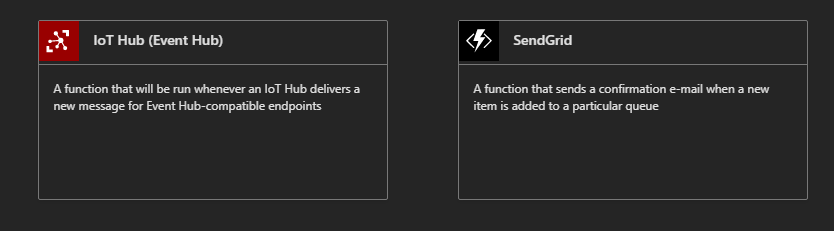

# Azure IoT Central PoC Demo

This is a demo to show how Azure IoT Hub and Azure IoT Central Services can be used to deliver an end-to-end IoT solution, from the devices to visualization in IoT Central dashboard.

## Overview of The System

The system consists of a simple and common IoT flow, where there is a device (which will be simulated), it securely connects to an endpoint in the cloud and sends its telemetry. Device telemetry will then be processed and transformed in a particular manner before it is visualized for business intelligence.

The architecture below visualizes the major components of the solution:


To put the solution together, the following Azure Services will be used:

- **Azure IoT Hub** - IoT Hub is a managed service, hosted in the cloud, that acts as a central message hub for bi-directional communication between your IoT application and the devices it manages.
- **Azure IoT Central** - Azure IoT Central is a fully managed SaaS (software-as-a-service) solution that makes it easy to connect, monitor and manage your IoT assets at scale.
- **Azure Functions** - Azure Functions is a serverless compute service that lets you run event-triggered code without having to explicitly provision or manage infrastructure.
- **Azure Cosmos DB** - Azure Cosmos DB is Microsoft’s globally distributed, multi-model database service for operational and analytics workloads. It offers multi-mastering feature by automatically scaling throughput, compute, and storage.

## What You'll need

- An Azure account with an active subscription
- A text editor
- Deployment code and files which can be found in this repository
- Basic knowledge of any programming language

## Instructions

1.  You'll use the Azure CLI to deploy all of the resources in the solution.The Azure command-line interface (CLI) is Microsoft's cross-platform command-line experience for managing Azure resources. Head over to https://docs.microsoft.com/en-us/cli/azure/install-azure-cli?view=azure-cli-latest and download the latest version of the Azure CLI appropriate for your operating system.
2.  After installing the Azure CLI, run

            $ az login

    This will log you into the approriate azure account you want to use.

3.  Start by creating a resource group. A resource group is a container that holds related resources for an Azure solution.You may replace _example_ with the name you want to give to your resource group but remember to change to that name whenever we need to deploy additional resource. Depending on where you are located, you may want to change the location, but this is not important for now.

        $az group create --name example --location "East US"

Take a note of the resource group name you used above, you will need it in subsequent steps.

4.  Now that you have a nice container for your resources, you can begin deploying the required resources. You will deploy the Azure IoT Hub, a Function App (where all your Azure Functions will be hosted) and the Azure Cosmos DB for data storage. The deployment template and a parameter file is provided in this repository. cd into the _deployment_templates_ folder. There are two files, the template.json files describes the resources that will be provisioned in Azure and the _parameters.json_ are the parameters that will be used to deploy these resources.
5.  Open the _parameters.json_ file in your text editor. On a property called _parameters_ you will find all the necessary resources that the template needs to deploy the resources. They all have a value of `null`. For each, input a unique string(preface it with your name or the name of your company e.g mycompanymainDB to ensure the names are globally unique). Avoid special charcaters as some of the resources accept only letters.
6.  Run the following command, changing the `example` resource group name to whatever you noted down. The deployment will take some time. Wait for it to finish, in the mean time, you can check your resource group in the portal and confirm resources are being deployed in it.

        $ az group deployment create --name ExampleDeployment --resource-group example --template-file template.json --parameters parameters.json

The most likely issue you might encounter when deploying the resources is errors to do with unique or illegal values in your parameters file. Please note that the CLI will deploy the other resources with valid names even if one or more of the resources fail to deploy as a result of invalid names entered. After deployment, if you get an error message, read the error, and change only the parameter value causing the error and run the above command again. The resources will not be duplicated if they are already deployed.

7. If you view your resource group on Azure Portal, you should see 6 resources as shown below:


The first 4 resources (Storage account,App Service, Application Insights, App Service Plan) are resources to support your functions, the Azure Cosmos DB account is where all your databases will live and the IoT Hub is your cloud endpoint for devices to connect to.

8.  Add the Azure IoT CLI extension to the Azure CLI by running:

        $az extension add --name azure-cli-iot-ext

You will need this later.

9.  Next, deploy the Azure Central Application that will receive and visualize the processed IoT telemetry. Run the following command, changing the `--resource-group` parameter (to the one you noted down), the `--name` and the `--subdomain`. You can change the `--display-name` to have a custom display name on the Azure Central site. The `--subdomain` and `--name` parameter must be unique, so come up with a random string (use your name or the name of your company plus some random characters). You may need to change these parameters a few times before the deployment succeeds.

        $az iotcentral app create --resource-group "example" --name "myiotcentralapp67ramds" --subdomain "myuniquesubdomain" --sku S1 --template "b922fba8-b44c-46e9-8e1f-c44b95bac98a" --display-name "HumidityandTempSensor"

10. Log back to the portal and confirm the Azure IoT Central Application was deployed. Click on the resource. There isn't much you can do with the Application from the Portal, but from there you will get the application's url. Follow the URL and you will land on the Dashboard of the IoT Central Application.

11. On the Left Side bar, under **App settings** click on **Device Templates**.


Click the **humidity_temp_sensor** template. You will see the configured measurements that the template expects from the device. The visuals will start to populate with some values, these are simulated values from the app itself, it just gives you an idea of how everything will be working.

12. The **Device Template** is only a blue print of what data points the device is sending, you still need to configure an actual device. On the side navigation, click on **Devices**. You should see the the **humidity_temp_sensor** template. Click on it. Notice there is already a device for this template, that was generated automatically and it simulates your device data. Select **+**, then Real. Click **Create**


The device is now created and ready to receive telemetry.

13. All the required resources are set up. Referring back to the system architecture, the first block in the flow is the virtual device (or a real one if you have one). Before a device is allowed to talk to the IoT Hub, it needs to be registered with that particula Azure IoT Hub. Run the command below on the terminal to register and create a device in the IoT Hub. You can log back into the portal and confirm the name of your IoT hub, change the `--device-id` to your preferred name.

        $ az iot hub device-identity create --hub-name {YourIoTHubName} --device-id mySimulatedDevice

14. The device is registered but you need its connection string which has the endpoint and keys. To get this, run the following command.

        $ az iot hub device-identity show-connection-string --hub-name {YourIoTHubName} --device-id mySimulatedDevice

Copy the returned `connectionString` value and store it somewhere, you will need it in the preceeding steps.

15. Next is to make the virtual device, for convenience purposes, a function will be used to simulate data sent from a real device. You could run this on your own computer or on an actual device. JavaScript (NodeJS) will be used to write the simple application to simulate the device. Head back to the portal and click on the on the Function App (it is listed as an App Service resource type)


16. You will need to configure the Function application with some configuration settings before you start writing the functions.

- Go back to your resource group and select the **Storage account** resource. Under **Settings**, click on **Access keys**. Copy the Connection string of **key1**.
- Click on the Function App again. At the top, click on **Platform features**, then select **Configuration** which is under **General Settings**.
- Under **Application settings**, Click on the **+** to add **New application setting**. The Name of the setting is **AzureWebJobsStorage**, and the Value is the connection string you copied from the Azure Storage account. Click **OK**.
- As you did above, add additional application settings with the below parameters:
  - **Name**: WEBSITE_NODE_DEFAULT_VERSION **Value**: 10.14.1
  - **Name**: FUNCTIONS_EXTENSION_VERSION **Value**: ~2
  - **Name**: FUNCTIONS_WORKER_RUNTIME **Value**: node
- Save the settings.

17. The first function you will create will simulate the virtual device. A convenient way to do this is to use a timer function that will be triggered periodically to send data to the IoT Hub (the same way a real device would). Click on the **+** under your Function's App to create a function. Click on **Timer trigger**. If you don't see this right away, click on either **Add Custom Function** or **Load More Templates**


Give the function a descriptive name, like **simulated-device**. On the Schedule, input `*/15 * * * * *`, this will fire the function every 15 seconds. Click create.


To confirm your function is actually running, click on it, this should open the index.js file of the function, at the bottom of the pane, click on the **Logs** tab to expand it. Your output should be similar to the below illustrations (the logs may have a slight delay, try refreshing the app).


18. Click on the **simulated-device** function, on your far right, you should see the files that the function needs.Currently, you should have two files; **function.json** and **index.js**.


Open the **simulated-device** folder in this repository. With a text editor such as VSCode, open the `index.js` file. The code sends simulated temperature and humidity values(and the device Id) to an IoT Hub endpoint. You need to edit the connection string value of the IoT Hub to send it to your configured hub and device (the IoT Hub connection string you noted down while registering a device).

```JavaScript
// Using the Azure CLI:
// az iot hub device-identity show-connection-string --hub-name {YourIoTHubName} --device-id MyNodeDevice --output table
var connectionString =
  "{input your connection string here}";

```

Save the file.

19. Back in the Azure Portal and in the Function App. Click on the **simulated-device** function. On the tab on the far right, click **View files**, then **upload**. Upload both the **index.js** and **package.json** file from **simulated-device** folder in this repository.

20. In the portal, under your function, you should see some tabs at the bottom. Click on **Console** and run `npm install` to install the required node modules.


If you view the files again, you should see a `node_modules` folder and a `package-lock.json` file. You many need to restart the app to see this (There is a restart icon on the top Level Function Application).


21. The Function should be sending telemetry to your IoT Hub every 15 seconds. Go back to your resource group and click on the IoT Hub. Under, the **Overview** Tab, scroll to bottom, there is a Visualization card named **IoT Hub Usage**, on it you will see the number of messages sent today (if it it more than zero, then the device simulator function is working correctly).


22. The messages are successfully arriving at the IoT Hub, you need to take these messages and process them before forwarding them to the Azure IoT Central application. Again, Azure Functions will be used for this task, but this time instead of the trigger being a timer, the trigger will be a message arriving at the IoT Hub end point.
23. Head back to your Function App and add another function. This time, select the **IoT Hub (Event Hub)** template.
    
24. Install the required extensions (this may take a while). Give the Function a descriptive name like `intermediateProcessing`. Under **Event Hub connection**, click **new**, then choose **IoT hub**, on the drop down that appears, choose the appropriate IoT hub you configured for the resource group (the one you registered the device in). Click **Create**
    .
25. If you check the newly created function's logs you should get a similar output as the one shown below:


Go back to the web dashboard of the Azure Central Application you created. Click on **Devices** then choose the **humidity_temp_sensor**, select the real device you made, at the top of the device dashboard, click **Connect**.


take note of the **Scope ID**, **Device ID**, and **Primary Key**.

26. On this repository, there is a folder named **intermediateProcessing** that contains code for the function app that processes data sent from the IoT Hub. Open this folder and change the below values with what you have noted down:

```JavaScript
const idScope = "{Scope ID}";
const registrationId = "{Device ID}";
const symmetricKey = "{Primary Key}";

```

Remember to save the file.

This function takes data from the Azure IoT Hub, calculates some additional values (chanceOfRain, temprature in Fahrenheit, timestamp, temprature status), before sending the processed data for visualization in the IoT Central Application. All the data processed is stored in Azure Cosmos DB for data persistence.

27. The process of configuring the function is almost identical to the **simulated-device** function that was configured earlier. Upload both the `index.js` and the `package.json` file to the `intermediateProcessing` function in the cloud. Run npm install. At this point, your application should **NOT** be working because Azure CosmosDB has not yet been configured.

28. Click on the **intermediateProcessing** function in the portal, then choose **Integrate**


Under Outputs, Click the **+** to add a new Output. Choose **Azure Cosmos DB** as your output.


29. You will need to install the extension. When that is done (if it hangs for too long just proceed), confirm the details of the CosmosDB accounts. Select the **If true, creates the Azure Cosmos DB database and collection**.

30. Under **Azure Cosmos DB account connection**, click on **_new_**. This opens a popup, which allows you to choose the appropriate Azure Cosmos DB account (the one you provisioined on this resource group). Please note that if you have other Azure Cosmos DB accounts, they will also appear (and you could as well store data in them), so choose the appropriate account. Leave all the other settings as they are. Click **Save**.


31. You may need to stop and start the Function App before it works as expected (When testing, the logs sometimes indicate that a certain module is not found, when infact the node_modules folder is already installed, so you need to restart the application and after a few seconds everything should be working as expected).

32. Confirm that data is being stored in the Azure CosmosDB database. Go to your Resource Group, click on the Azure CosmosDB Account. On the overview pane, near the top there is a **Data Explorer** link that enables you to view your data. You should see a database named `outDatabase`, and a collection called `MyCollection`. Click on `MyCollection` then click on `Items`. You should see a collection of documents that represent the telemetry your device is producing (actually, this data is coming from the Azure function that processes the telemetry). Click on any one of them, you will see a document containing a number of parameters (some are generated automatically, but some were calculated from the `intermediateProcessing` function).


33. Switch over to your IoT Central Application and locate the real device you registered. On the Device page, you should see data trickling in.


Click on the Dashboard page of that device (still on the Azure IoT Central app), you should see a consolidated visual graphing of the data.


## Clean Up The Resources

To delete all of the resources at once run the following command, be sure to change the `--name` parameter to whatever you called your resource group.

        az group delete --name ExampleGroup
