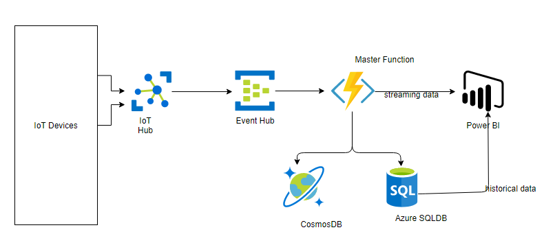
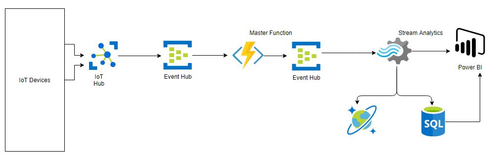

# Project

The project involves the typical IoT application scenario, devices collect data, data is sent to an endpoint, data is cleaned and stored and finally visualized in a dashboard endpoint.

## Emphasis

- Use of Azure Event Hubs to decouple data processing
- Exploring Azure Stream
- Use of IoT Hub Routes as the default routing architecture
- Use of message enrichment on routes to stamp additional properties to the message
- Getting additional properties(metadata) about the telemetry and storing to the db

## Architecture

For this project, we will explore two different approaches of achieving the same result:- both have their own pros and cons, which will be explored.

### Approach 1

This is perhaps the simplest and works for most situations. Below is an architecture guideline to

- Messages are received at the IoT Hub
- They are enriched with additional properties such as the deviceID, and twin tags before being forwarded to and Event Hub (can be the built in event hub compatible endpoint)
- A function runs every time a message arrives at the event Hub, this function formats the data appropriately, stores it both to Cosmos DB and an SQL Database before forwarding to PowerBI for realtime visualizations of the timeseries data
- Historical analysis will also be performed on the data stored on the SQL Database PowerBI

#### Pros

- Simple and inexpensive since less components are used

#### Cons

- The Azure Function is doing too much, there is no clear separation of concerns

### Approach 2

The second approach is to decouple some of the logic done by the master function to Stream Analytics through an intermediate event Hub. The architecture is provided below:

#### Pros

- Separation of concerns provides room for extensibility since each piece is doing a clearly defined task. The function's only work is formatting the data appropriately and loading it to the Event Hub for additional action by Stream Analytics.
- Suitable if one wants to treat telemetry as batches (e.g. the past hour) rather than single independent events

## Common Steps

To deploy both the proposed architecture follow the following steps. A little Azure knowledge is assumed.

1. Create a new resource group you will use for the project.
2. Create an IoT Hub (S1 tier is good enough)
3. Provision two devices in the IoT Hub
4. Create a Function App with JavaScript Runtime (Node v12 +)
5. Create an Event Hub Namespace and add two Event Hubs, `raw` and `processes`, add a consumer group in each of the EventHubs
6. Create a CosmosDB Account, we will not be creating the SQL DB
